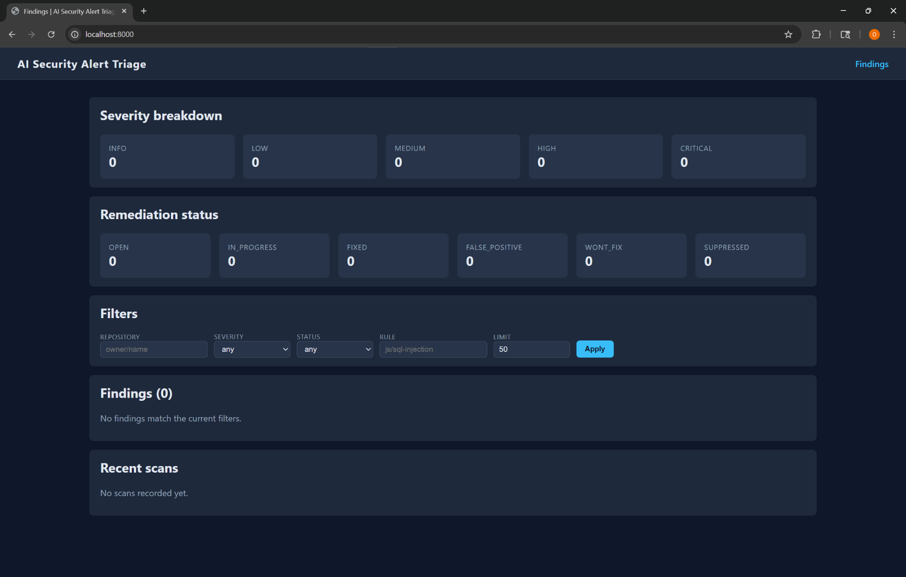

# AI Security Alert Triage Pipeline

     [](https://ai-security-alert-triage-pipeline-production.up.railway.app)

## Screenshot



## Live Demo

The dashboard is deployed and publicly accessible at
[ai-security-alert-triage-pipeline-production.up.railway.app](https://ai-security-alert-triage-pipeline-production.up.railway.app).

The deployment runs on Railway with a managed PostgreSQL database.
GitHub Actions runs CodeQL on every push and scheduled scan, the
AI Triage workflow classifies findings through the OpenAI API, and
results persist to the live database where the FastAPI dashboard
reads from.

A DevSecOps pipeline that integrates CodeQL static analysis with an OpenAI-backed triage agent and a PostgreSQL-backed dashboard. Every pull request runs CodeQL, the resulting SARIF report is ingested into Postgres, and an AI agent classifies each finding by severity, scores its false-positive likelihood, and writes a short justification. Engineers track remediation state from a small server-rendered dashboard.


## Why this exists

Manual triage of static analysis output does not scale. Most teams either ignore CodeQL alerts entirely or burn engineering hours sifting through low-signal results. This project automates the first pass of that triage and keeps an audit trail of every decision in PostgreSQL.

## Architecture overview

The pipeline is composed of four cooperating layers.

1. CodeQL workflow. A GitHub Actions job runs CodeQL on each pull request, uploads results to the GitHub security tab, and publishes the SARIF report as a workflow artifact.
2. Triage workflow. A second workflow downloads that artifact, ingests every SARIF result into PostgreSQL, and runs the OpenAI triage agent against any pending finding.
3. AI triage agent. A Python module that wraps the OpenAI Chat Completions API, sends a structured prompt for each finding, and validates the response against a JSON Schema using Pydantic.
4. Dashboard. A FastAPI application reads from PostgreSQL and renders a list of findings, severity counts, remediation totals, and a per-finding form for updating remediation state.

The Python package follows a clean src layout. SQLAlchemy 2.0 models cover scans, findings, triage results, and remediation rows. Alembic owns the schema migrations.

## Features

* SARIF parser that normalises CodeQL output (severity hints, fingerprints, tags, source locations).
* Configurable OpenAI triage agent that returns a structured TriageDecision (severity, false-positive likelihood, justification, optional suggested action).
* PostgreSQL data layer with scans, findings, triage results, and remediation tables, plus Alembic migrations.
* Typer CLI with subcommands for ingestion, triage, status queries, recent scans, and remediation updates.
* FastAPI dashboard with severity and remediation breakdowns, server-rendered Jinja2 templates, and per-finding remediation forms.
* GitHub Actions workflows for CodeQL, AI triage, and CI (ruff, black, mypy, pytest).
* Test suite covering the SARIF parser, the data layer (against an isolated SQLite fixture), and the triage agent (with a mocked OpenAI client).
* Docker Compose file that brings up PostgreSQL and the dashboard for local development.

## Prerequisites

You will need the following installed locally.

* Python 3.11 or newer.
* Docker and Docker Compose v2 (only required if you want to run PostgreSQL through Compose).
* A PostgreSQL 16 server reachable from your workstation. The Compose file launches one for you.
* An OpenAI API key with access to the model you select via OPENAI_MODEL. The default is gpt-4o-mini.

## Installation

Clone the repository, create a virtual environment, and install the package in editable mode with the dev extras.

```bash
python -m venv .venv
source .venv/bin/activate    # on Windows use .venv\Scripts\activate
pip install --upgrade pip
pip install -e ".[dev]"
```

The editable install registers the `ai-triage` console script and pulls in all dev tooling (ruff, black, mypy, pytest, pytest-cov, pytest-mock).

## Environment configuration

Copy `.env.example` to `.env` and adjust the values for your environment.

```bash
cp .env.example .env
```

Required variables:

* DATABASE_URL: SQLAlchemy connection URL for PostgreSQL.
* OPENAI_API_KEY: API key passed to the OpenAI client.
* OPENAI_MODEL: Model identifier (defaults to gpt-4o-mini).

Optional variables include OPENAI_TIMEOUT_SECONDS, OPENAI_MAX_RETRIES, DASHBOARD_HOST, DASHBOARD_PORT, DEFAULT_REPOSITORY, and LOG_LEVEL. See `.env.example` for the full list and inline descriptions.

## Running locally with Docker Compose

The simplest way to get a working environment is to start PostgreSQL through Compose.

```bash
docker compose up -d postgres
```

That launches a PostgreSQL 16 instance on `localhost:5432` with the default credentials `triage` / `triage`. To bring up the dashboard service alongside the database, run:

```bash
docker compose up --build
```

The dashboard becomes available at http://localhost:8000.

## Running migrations

Schema migrations are managed by Alembic. To apply every migration to the configured database, run:

```bash
alembic upgrade head
```

To create a new migration after editing the SQLAlchemy models:

```bash
alembic revision --autogenerate -m "describe your change"
alembic upgrade head
```

If you ever need to bootstrap a database without Alembic (for example, against an ad hoc SQLite file used by tests), the helper script `scripts/init_db.py` will call `Base.metadata.create_all` for you.

## Running the CLI

Once the package is installed, the `ai-triage` entry point is on your PATH. Run `ai-triage --help` to see every subcommand.

```bash
# Parse a SARIF file and persist the findings.
ai-triage ingest ./codeql.sarif --repository acme/app --commit abcdef1 --branch main

# Run the AI triage agent against pending (untriaged) findings.
ai-triage triage --limit 25

# Print the most recent findings and their remediation state.
ai-triage status --limit 25

# Update the remediation state for a single finding.
ai-triage set-status 42 fixed --notes "Patched in PR 1234"

# List recent scans.
ai-triage scans --limit 10
```

Every command honours environment variables loaded from `.env`, so a single configuration covers both the CLI and the dashboard.

## Running the dashboard

To launch the FastAPI dashboard locally, run:

```bash
uvicorn ai_triage.dashboard.app:app --reload
```

Then open http://localhost:8000. The home page shows severity counts, remediation totals, recent scans, and a filterable findings table. Each finding has a detail page with the AI triage decision and a form for updating remediation state.

A health check endpoint is available at `/health` and is used by the Docker image's HEALTHCHECK directive.

## Running tests

The test suite uses pytest, an isolated SQLite fixture for the data layer, and mocks the OpenAI client so no network access is required.

```bash
pytest
```

To run lint, formatting, and type checks separately:

```bash
ruff check src tests
black --check src tests
mypy src
```

The same commands run automatically in the CI workflow.

## Project structure

```
ai-security-alert-triage-pipeline/
├── .github/
│   └── workflows/
│       ├── codeql.yml         CodeQL static analysis on pull requests
│       ├── triage.yml         Ingestion and AI triage workflow
│       └── ci.yml             Lint, format, type check, tests
├── alembic/                   Schema migrations
│   ├── env.py
│   ├── script.py.mako
│   └── versions/
├── alembic.ini
├── docker-compose.yml         Local PostgreSQL and dashboard services
├── Dockerfile                 Dashboard service image
├── docs/                      Screenshot and supporting assets
├── pyproject.toml             Package metadata and tool configuration
├── scripts/
│   └── init_db.py             Bootstrap helper used by tests and quick demos
├── src/
│   └── ai_triage/
│       ├── __init__.py
│       ├── cli.py             Typer entry point
│       ├── config.py          Pydantic settings
│       ├── parser.py          SARIF parser
│       ├── services.py        Ingestion and triage orchestration
│       ├── triage.py          OpenAI triage agent
│       ├── dashboard/         FastAPI app and Jinja2 templates
│       │   ├── __init__.py
│       │   ├── app.py
│       │   ├── static/
│       │   └── templates/
│       │       ├── base.html
│       │       ├── index.html
│       │       └── finding.html
│       └── db/                SQLAlchemy models, sessions, repositories
│           ├── __init__.py
│           ├── models.py
│           ├── repositories.py
│           └── session.py
├── tests/
│   ├── conftest.py
│   ├── test_parser.py
│   ├── test_db.py
│   └── test_triage.py
├── .env.example
├── .gitignore
├── LICENSE                    MIT license file
└── README.md
```
Built by Omar Rifaie - [github.com/omarrifaie](https://github.com/omarrifaie) · [linkedin.com/in/omar-rifaie-](https://linkedin.com/in/omar-rifaie-)
